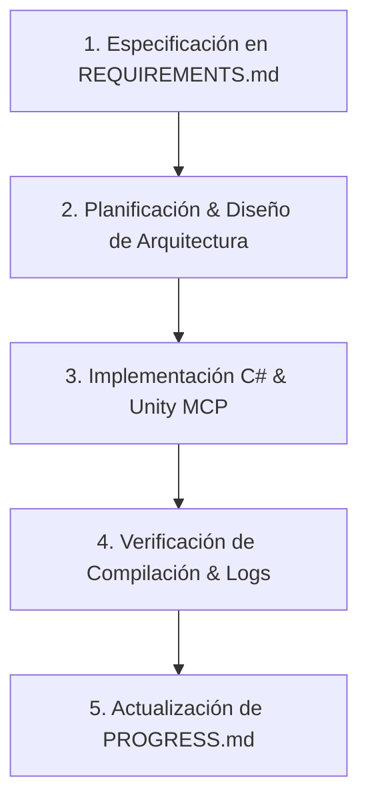

# Workflow y Roles de Desarrollo: Gunbound Mobile 2.5D

Este documento define el marco de trabajo, la distribución de roles y la metodología para llevar a cabo el desarrollo del proyecto de forma limpia, estructurada y mantenible.

---

## 1. Definición de Roles

Para mantener una arquitectura sólida y un flujo de trabajo sin fricciones, se establecen los siguientes roles operacionales:

| Rol | Responsable | Funciones Principales |
| :--- | :--- | :--- |
| **Product Owner / Lead Architect** | Usuario / Desarrollador Principal | • Define requerimientos de juego y especificaciones de diseño. • Aprueba las fases de implementación y decisiones de arquitectura. • Revisa y prioriza el backlog de tareas. |
| **AI Pair Programmer & Senior C# Developer** | Antigravity AI Agent | • Diseña la arquitectura limpia, decoupled y determinista en C#. • Escribe código siguiendo los principios SOLID, DRY y `.clinerules`. • Manipula la escena de Unity mediante Unity MCP (sin editar YAML directamente). • Actualiza la documentación en `Docs/` al concluir cada hito. |
| **QA & Verification Engineer** | Antigravity AI + Usuario | • Inspecciona logs de consola (`Unity_GetConsoleLogs`) tras cada compilación. • Valida la física, comportamientos balísticos y fluidez en 16:9 mobile. • Comprueba que no existan excepciones o fugas de memoria. |

---

## 2. Flujo de Trabajo (Step-by-Step Workflow)

El ciclo de vida de cada característica o refactorización sigue estrictamente las siguientes 5 fases:

### Fase 1: Especificación del Requerimiento
1. Todo requerimiento nuevo o ajuste debe estar registrado o actualizarse primero en `Docs/REQUIREMENTS.md`.
2. Se definen criterios de aceptación claros (física determinista, eventos desacoplados, UI responsive 16:9).

### Fase 2: Planificación de la Solución
1. El Agente analiza el estado actual del código y propone los cambios o el plan de ejecución.
2. Se verifica que la solución respete las directrices operativas (`.clinerules`).

### Fase 3: Implementación Limpia
1. **Código C#**: Uso estricto de `[SerializeField] private`, eventos `System.Action`/`UnityEvent`, naming `PascalCase` / `_camelCase`.
2. **Escena de Unity**: Modificaciones de objetos, componentes y prefabs realizadas únicamente a través de la API Unity MCP (`Unity_RunCommand`, etc.) para preservar la integridad de los metadatos YAML.

### Fase 4: Verificación y Testing
1. Revisión de errores de compilación o warnings en la consola mediante la herramienta de consola del MCP.
2. Pruebas visuales o cinemáticas según el módulo desarrollado.

### Fase 5: Registro de Progreso
1. Una vez validada la característica, se actualiza inmediatamente `Docs/PROGRESS.md`.
2. Se marca el estado de la tarea (Pendiente → En Progreso → Completado) y se registra una breve nota en el historial de cambios.

---

## 3. Normas de Calidad y Buenas Prácticas

1. **Física Determinista**: Cálculos de trayectoria balística y viento desacoplados de `Rigidbody2D` directo para proyectiles principales, garantizando preparación para multijugador.
2. **Desacoplamiento Estricto**: Comunicación entre Managers (ej. `SatelliteManager`, `BattleManager`, `HUDManager`) basada en eventos y no en dependencias directas de Singleton rígidas cuando no sean requeridas.
3. **Mantenimiento de Documentación**: La carpeta `Docs/` es la fuente de verdad. No deben existir tareas en código que no estén referenciadas en el progreso o los requerimientos.
